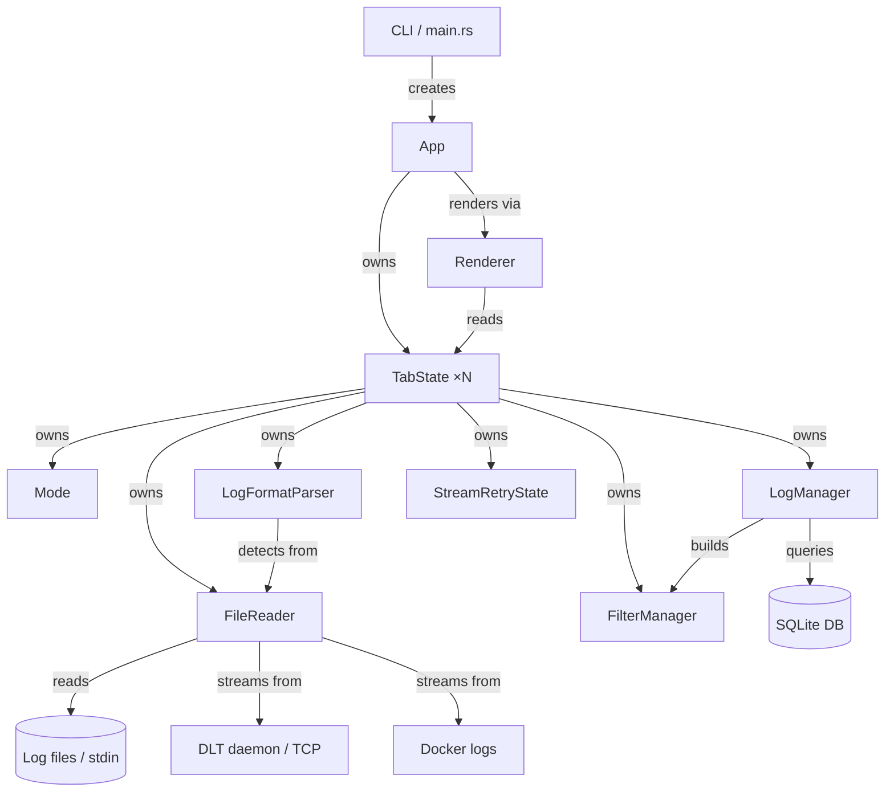
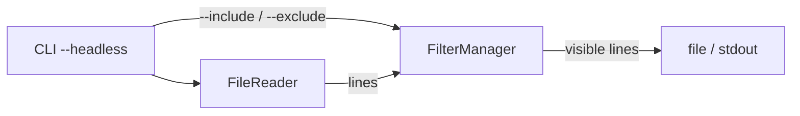
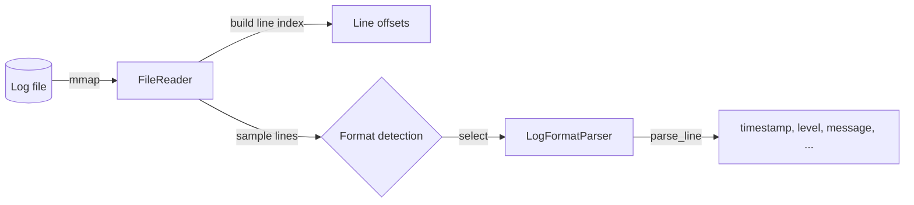
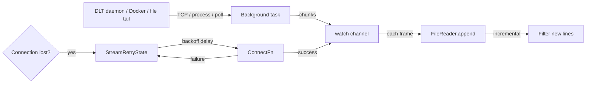
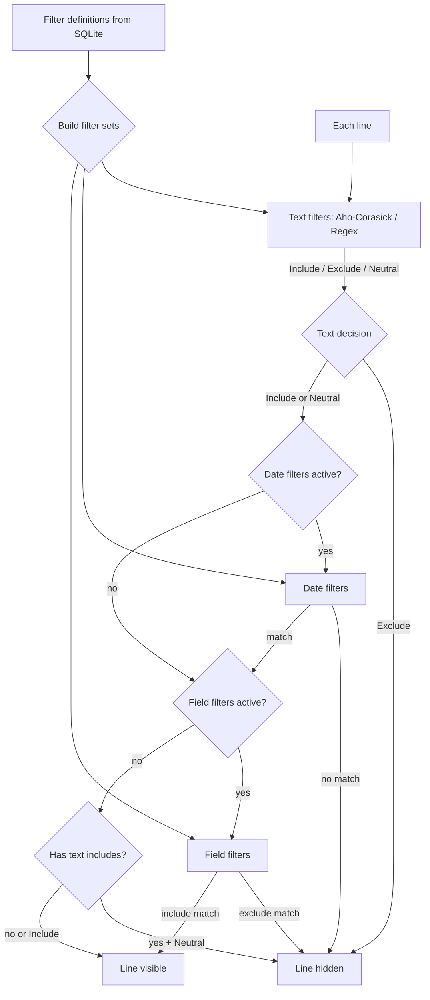

# logana Architecture

Terminal-based log analysis tool built in Rust with a Ratatui TUI. Logs are read via memory-mapped files; filters and UI context are persisted in SQLite.

## High-Level Design

logana is structured around a strict separation between domain logic and the UI layer. The application is divided into five broad concerns:

**File I/O & Ingestion** — `FileReader` memory-maps regular files and exposes O(1) random line access via a pre-built offset index. 
- Stdin is handled separately by a background thread that accumulates bytes and publishes snapshots. 
- Streaming sources (DLT TCP, Docker logs, file tailing) deliver chunks through a watch channel that the event loop appends each frame. 
- Binary data formats like DLT are converted to newline-delimited text before entering the line-based pipeline.

**Log Parsing** — A format-detection registry (`parser/`) inspects incoming bytes and selects the best `LogFormatParser` implementation (JSON, syslog, journalctl, logfmt, CLF, DLT, etc.). 
- Parsers extract a normalised set of fields (timestamp, level, message, structured fields) that the rest of the system consumes uniformly regardless of the original format. 

**Filter Pipeline** — `FilterManager` compiles filter definitions into Aho-Corasick automata or regexes and evaluates them against every line to produce a visibility bitmap.
- The pipeline runs in a background thread so the UI stays responsive during large scans. 
- For streaming sources, new lines are filtered incrementally. 
- Filter definitions are persisted to SQLite and reloaded on startup.
- Date filters (`@date:` prefix) and field filters (`@field:` prefix) are stored as regular filter entries but applied as separate post-processing steps after text filters run.

**Mode System** — The UI is vim-inspired: a state machine (`mode/`) where each mode captures keyboard input and handles it independently. Modes return a `KeyResult` that the event loop acts on for effects beyond the mode's scope (closing tabs, clipboard, navigation).
- **Normal** — default log browsing, scrolling, marks
- **Command** — `:` command input with tab completion
- **Search** — `/` and `?` incremental search
- **Filter** — sidebar filter management (add, edit, toggle, reorder)
- **Visual / Visual Char** — line and character selection for copy/export
- **Comment** — annotate individual log lines
- **Select Fields** — choose and reorder displayed fields
- **DLT Select / Docker Select** — pick a streaming source to connect to
- **UI / Keybindings Help** — settings and shortcut reference

**UI & Rendering** — `ui/` owns the terminal handle and drives the Ratatui render loop. 
- The renderer reads tab state and produces widgets each frame; it never mutates state. 
- The event loop dispatches key events to the active mode and acts on the returned result. 
- Session state (open tabs, filters, marks, scroll position) is persisted to SQLite and restored on reopen. 

**Headless** - A headless mode bypasses the TUI for scripted filter-and-export workflows.

## Component Diagram

## Headless Mode

## File-Based Ingestion

## Stream-Based Ingestion

## Filter Pipeline

## Dependencies

| Crate | Role | Why |
|---|---|---|
| **ratatui** | TUI rendering | Immediate-mode terminal UI; widgets are stateless values composed each frame, which eliminates a whole class of stale-state bugs |
| **crossterm** | Terminal I/O, key events | Cross-platform raw mode and keyboard input, including kitty keyboard protocol for disambiguating modifier keys |
| **tokio** | Async runtime | Drives the event loop and background tasks (file loading, filter computation, stdin streaming) without blocking the render thread |
| **memmap2** | Memory-mapped file I/O | Zero-copy random access to arbitrary byte ranges; `get_line` is O(1) with no heap allocation per call |
| **memchr** | SIMD byte scanning | Accelerates the line-indexing pass; scanning for `\n`, `\r`, and ESC in a single pass is faster than calling `memchr` three times separately |
| **aho-corasick** | Literal substring matching | Optimal for the common case of plain-text filter patterns; builds a finite automaton once and matches in O(input) regardless of pattern count |
| **regex** | Regex matching | Used only when a pattern contains metacharacters; compiled once and cached |
| **rayon** | Parallel iteration | Parallelises both Phase 1 line indexing (chunk scan) and the visibility scan across file lines on machines with multiple cores; transparent fallback to sequential on single-core |
| **sqlx** | SQLite async driver | Persists filter definitions and session state (scroll position, marks, comments) between runs; async so DB writes don't stall the event loop |
| **clap** | CLI argument parsing | Declarative argument definitions with auto-generated help text |
| **serde / serde_json** | Config and theme serialisation | JSON config file, theme files, and filter import/export |
| **serde_with** | Serde helpers | Provides derive macros for custom serialisation of types that don't implement `Serialize`/`Deserialize` directly, used for persisting ratatui `Color` values in the DB |
| **time** | Date and time parsing | Parses and normalises timestamps for the date-range filter; chosen over `chrono` for its stricter API and active maintenance |
| **unicode-width** | Terminal column width | Correctly measures the display width of Unicode characters (CJK double-width, zero-width combiners) so cursor positioning and text truncation stay accurate |
| **arboard** | Clipboard | Cross-platform clipboard access for yank/copy operations |
| **dirs** | XDG data directory | Locates the platform-appropriate directory for the SQLite database without hardcoding paths |
| **anyhow** | Error handling | Ergonomic error propagation with context in the top-level `main` |
| **async-trait** | Async trait methods | Native `async fn` in traits (stable since 1.75) is not object-safe: each impl returns a differently-sized future, which a vtable cannot handle. The crate rewrites async methods to return `Pin<Box<dyn Future>>` — a fixed-size pointer — making the trait usable as `Box<dyn Mode>`. The same can be written by hand; the crate is purely a syntactic convenience |
