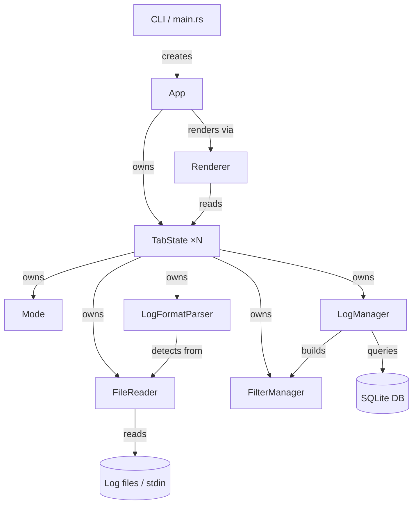

# logana Architecture

Terminal-based log analysis tool built in Rust with a Ratatui TUI. Logs are read via memory-mapped files; filters and UI context are persisted in SQLite.

## High-Level Design

logana is structured around a strict separation between domain logic and the UI layer. The application is divided into five broad concerns:

**File I/O & Ingestion** — `FileReader` memory-maps regular files and exposes O(1) random line access via a pre-built offset index. Stdin is handled separately by a background thread that accumulates bytes and publishes snapshots. In both cases the data source is abstracted away from the rest of the system.

**Log Parsing** — A format-detection registry (`parser/`) inspects incoming bytes and selects the best `LogFormatParser` implementation (JSON, syslog, journalctl, logfmt, CLF, etc.). Parsers extract a normalised set of fields (timestamp, level, message, structured fields) that the rest of the system consumes uniformly regardless of the original format.

**Filter Pipeline** — `FilterManager` compiles filter definitions into Aho-Corasick automata or regexes and evaluates them against every line to produce a visibility bitmap. The pipeline runs in a `spawn_blocking` thread so the UI stays responsive during large scans. Filter definitions are persisted to SQLite by `LogManager` / `db` and reloaded on startup.

**Mode System** — Input handling is a state machine (`mode/`) where each mode owns its key handler and returns a `KeyResult` for side-effects it cannot perform itself. Modes hold only tab-scoped state; application-level effects (closing tabs, clipboard, global toggles) are dispatched back to the event loop. This keeps modes independently testable.

**UI & Rendering** — `ui/` owns the terminal handle and drives the Ratatui render loop. `Renderer` reads tab state and produces widgets each frame; it never mutates state. `App` owns the event loop, dispatches key events to the active mode, and acts on the returned `KeyResult`. Session state is persisted to SQLite and restored on reopen.

## Component Diagram



## Project Structure

```
src/
  main.rs             - Entry point, CLI args, runtime setup, app lifecycle
  lib.rs              - Library re-exports
  types.rs            - Shared data types
  parser/             - Log format detection and parsers
    mod.rs            - Format detection registry
    types.rs          - LogFormatParser trait and display types
    timestamp.rs      - Shared timestamp parsing and level normalization
    json.rs           - JSON log parser (tracing, bunyan, GELF)
    syslog.rs         - RFC 3164 + RFC 5424 syslog
    journalctl.rs     - journalctl text output (short-iso, short-precise, short-full)
    clf.rs            - Common Log Format + Combined Log Format
    logfmt.rs         - Logfmt key=value (Go slog, Heroku, Grafana Loki)
    common_log.rs     - env_logger, tracing fmt, logback, Spring Boot, Python, loguru
    otlp.rs           - OpenTelemetry log format
  date_filter.rs      - Date/time range and comparison filter
  file_reader.rs      - Memory-mapped file I/O with SIMD line indexing
  filters.rs          - Filter pipeline: matching, visibility, span rendering
  log_manager.rs      - Filter/mark/comment state with SQLite persistence bridge
  db.rs               - SQLite layer via sqlx
  search.rs           - Regex search with match positions and wrapping navigation
  mode/               - Mode state machine
    app_mode.rs       - Mode trait, ModeRenderState enum, KeyResult
    normal_mode.rs    - Scroll, mark, search, visual entry, count prefix
    command_mode.rs   - Command input with history and tab completion
    filter_mode.rs    - Navigate, toggle, delete, edit filters
    search_mode.rs    - Incremental search with live highlighting
    visual_mode.rs    - Line-range selection
    visual_char_mode.rs - Intra-line character selection
    comment_mode.rs   - Multiline comment editor
    ui_mode.rs        - Display-only toggles (sidebar, bar, borders, wrap)
    (other popup modes: keybindings_help, select_fields, docker_select, value_colors)
  ui/                 - Ratatui TUI
    mod.rs            - TabState, App structs, KeyResult, VisibleLines
    app.rs            - App lifecycle, key dispatch, command execution
    loading.rs        - File/stdin/docker loading, file watchers, session restore
    render.rs         - Logs panel, tab bar, sidebar, status bar
    render_popups.rs  - Popup/modal renders
    field_layout.rs   - Structured field layout helpers
  export.rs           - Template-based export to Markdown, Jira, etc.
  theme.rs            - JSON theme loading and color management
  value_colors.rs     - Per-token coloring for HTTP, status codes, IPs, UUIDs
  config.rs           - JSON config file loading
  auto_complete.rs    - Tab completion for commands, colors, file paths
  commands.rs         - Clap-based command definitions
templates/
  markdown.txt        - Bundled Markdown export template
  jira.txt            - Bundled Jira wiki export template
tests/
  integration.rs      - End-to-end flows
  stdin.rs            - Stdin reading tests
.github/workflows/rust.yml - CI: fmt, clippy, test, coverage (80% threshold via tarpaulin)
```

## File I/O & Ingestion

### File loading

Opening a file involves two concerns that pull in opposite directions: users want to see content immediately, but indexing a large file takes time. The solution is a two-phase load. The first phase reads the first (or last, in tail mode) `preview_bytes` of the file asynchronously and shows it right away. The second phase indexes the whole file in a background thread and swaps the reader in when done; progress is shown in the tab title. The preview size defaults to 16 MiB and is configurable via `preview_bytes` in `config.json`.

Memory-mapped files make it tempting to keep the entire file resident, but that wastes RSS on large files when only a few hundred lines are visible at a time. The indexing thread uses a separate "scan" mapping with sequential-access hints, then drops it after building the line-offset index. The "access" mapping used at runtime starts with zero RSS and faults in only the 4 KiB pages that contain lines currently being rendered. These two mappings are separate objects: on Linux, `MADV_DONTNEED` is advisory and may be ignored for file-backed shared mappings, so the only reliable way to free pages after indexing is to unmap and remap.

### Stdin ingestion

Stdin cannot be memory-mapped. A background thread accumulates bytes and publishes snapshots over a `watch` channel (last-value semantics). The event loop checks for a new snapshot each frame and replaces the tab's data if one arrived. A `watch` channel is used rather than `mpsc` because intermediate chunks are not interesting — what matters is always the most recent buffer state, avoiding unbounded queue growth when the producer outpaces the frame rate. The tab is updated in place so any active mode (such as a session-restore prompt) is not disrupted.

## Filter Pipeline

### Persistence vs. runtime representation

Filter definitions are stored in SQLite and loaded back as plain data records. At runtime they are compiled into a `FilterManager` that holds the actual Aho-Corasick automata or compiled regexes. This separation means the persistence layer deals only with strings and integers, and the expensive compilation step happens once when filters change rather than on every line scan.

The compiled `FilterManager` is shared across the tab via a reference-counted pointer. The render path clones the pointer (cheap), not the automata (expensive), so rendering never pays for recompilation.

### Why Aho-Corasick for literals

When a filter pattern contains no regex metacharacters it is treated as a plain substring. Aho-Corasick builds a single automaton from all literal patterns and scans the input in one pass, making it efficient regardless of how many filters are active. Regex is only compiled when the pattern actually requires it.

### Visibility semantics

Filters are evaluated top-to-bottom. The first matching filter wins — an Include match makes the line visible, an Exclude match hides it. If no filter matches and at least one Include filter exists, the line is hidden (Include filters act as an allowlist). If only Exclude filters exist, unmatched lines are shown.

This precedence model means the user can add a broad Exclude filter and then punch exceptions back in with higher-priority Include filters, without needing a separate "exception" concept.

### Keeping the UI responsive during large scans

Computing which lines are visible requires scanning every byte of the file. On a multi-gigabyte file this can take seconds. The scan is offloaded to a `spawn_blocking` thread so the Tokio event loop and the render path continue running. A cancel flag lets a new filter change abort an in-flight scan immediately rather than waiting for it to finish.

### Startup single-pass optimisation

Without this optimisation, startup with filters would require two full passes over the file: one to build the line-offset index, and a second to evaluate which lines are visible.

When filters are supplied via `--filters` at launch, the visibility predicate is evaluated on each line during the indexing pass itself, so the file is read exactly once. The speedup comes from two sources. First, total work is halved — each byte is touched once instead of twice. Second, cache locality: during indexing each page is already resident in the CPU's L2/L3 cache. Evaluating the filter immediately while the data is hot avoids re-faulting those pages in a later pass.

## Mode System

The render path never holds a borrow into the active mode. Instead, the mode produces a plain data value (`ModeRenderState`) describing what the screen needs to know (which popup to show, what text is in the search input, etc.) and the render pass reads that value. This avoids lifetime entanglement between the mode and the terminal frame.

## Session Persistence

Session state (scroll offset, marks, comments, filter definitions, display settings) is saved to SQLite keyed by the absolute file path and a hash of the file's first bytes. On reopen, the hash is checked before restoring — if the file has changed significantly the user is given the choice to restore or discard the previous session rather than silently applying stale annotations.

Filters are scoped per source file because a filter that is meaningful for one log file is usually noise for another. The exception is the `--filters` flag, which loads a filter set from a JSON file and applies it regardless of the source, intended for reusable filter profiles.

## Dependencies

| Crate | Role | Why |
|---|---|---|
| **ratatui** | TUI rendering | Immediate-mode terminal UI; widgets are stateless values composed each frame, which eliminates a whole class of stale-state bugs |
| **crossterm** | Terminal I/O, key events | Cross-platform raw mode and keyboard input, including kitty keyboard protocol for disambiguating modifier keys |
| **tokio** | Async runtime | Drives the event loop and background tasks (file loading, filter computation, stdin streaming) without blocking the render thread |
| **memmap2** | Memory-mapped file I/O | Zero-copy random access to arbitrary byte ranges; `get_line` is O(1) with no heap allocation per call |
| **memchr** | SIMD byte scanning | Accelerates the line-indexing pass; scanning for `\n`, `\r`, and ESC in a single pass is faster than calling `memchr` three times separately |
| **aho-corasick** | Literal substring matching | Optimal for the common case of plain-text filter patterns; builds a finite automaton once and matches in O(input) regardless of pattern count |
| **regex** | Regex matching | Used only when a pattern contains metacharacters; compiled once and cached |
| **rayon** | Parallel iteration | Parallelises the visibility scan across file lines on machines with multiple cores; transparent fallback to sequential on single-core |
| **sqlx** | SQLite async driver | Persists filter definitions and session state (scroll position, marks, comments) between runs; async so DB writes don't stall the event loop |
| **clap** | CLI argument parsing | Declarative argument definitions with auto-generated help text |
| **serde / serde_json** | Config and theme serialisation | JSON config file, theme files, and filter import/export |
| **serde_with** | Serde helpers | Provides derive macros for custom serialisation of types that don't implement `Serialize`/`Deserialize` directly, used for persisting ratatui `Color` values in the DB |
| **time** | Date and time parsing | Parses and normalises timestamps for the date-range filter; chosen over `chrono` for its stricter API and active maintenance |
| **unicode-width** | Terminal column width | Correctly measures the display width of Unicode characters (CJK double-width, zero-width combiners) so cursor positioning and text truncation stay accurate |
| **tracing / tracing-subscriber / tracing-appender** | Structured logging | Used for internal debug diagnostics; in release builds logging is compiled out entirely; in debug builds logs are written to a file so they don't interfere with the TUI |
| **arboard** | Clipboard | Cross-platform clipboard access for yank/copy operations |
| **dirs** | XDG data directory | Locates the platform-appropriate directory for the SQLite database without hardcoding paths |
| **anyhow** | Error handling | Ergonomic error propagation with context in the top-level `main` |
| **async-trait** | Async trait methods | Native `async fn` in traits (stable since 1.75) is not object-safe: each impl returns a differently-sized future, which a vtable cannot handle. The crate rewrites async methods to return `Pin<Box<dyn Future>>` — a fixed-size pointer — making the trait usable as `Box<dyn Mode>`. The same can be written by hand; the crate is purely a syntactic convenience |
