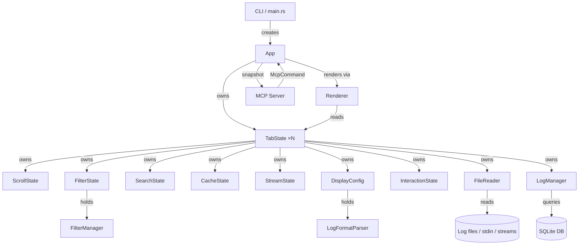
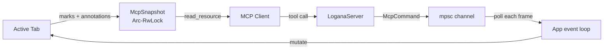
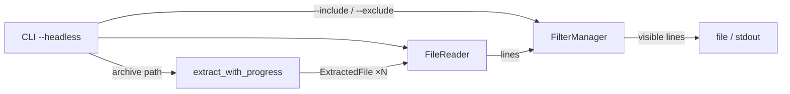
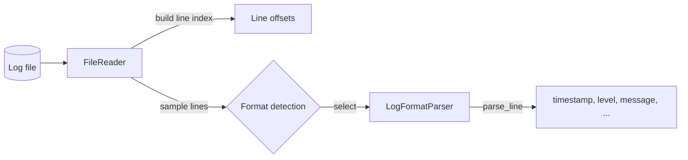
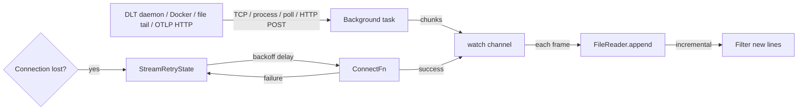
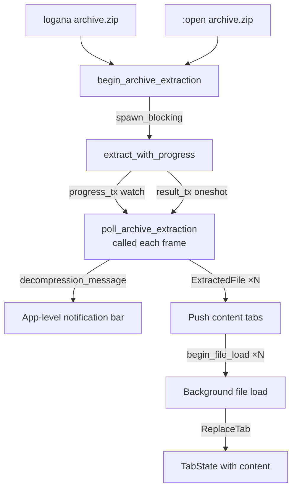
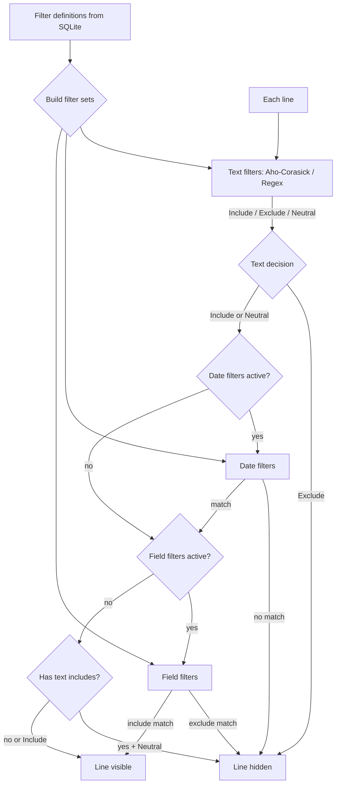

# logana Architecture

Terminal-based log analysis tool built in Rust with a Ratatui TUI. Filters and UI context are persisted in SQLite.

## High-Level Design

logana is structured around a strict separation between domain logic and the UI layer, divided into five broad concerns:

**File I/O & Ingestion** (`ingestion/`) — `FileReader` reads files and streaming sources (stdin, Docker, DLT TCP, file tailing, OTLP HTTP). Compressed and archive files are extracted in the background; only the extracted content is opened as tabs.

**Log Parsing** (`parser/`) — A format-detection registry inspects incoming bytes and selects the best `LogFormatParser` (JSON, syslog, journalctl, logfmt, CLF, DLT, etc.). Parsers produce a normalised `DisplayParts` struct consumed uniformly by the rest of the system. Extra fields carry a `FieldSemantic` tag enabling format-agnostic field filtering.

**Filter Pipeline** (`filters/`) — `FilterManager` compiles filter definitions into Aho-Corasick automata or regexes and evaluates them against every line to produce a visibility bitmap. The pipeline runs in a background thread. Filter definitions are persisted to SQLite and reloaded on startup.

**Mode System** (`mode/`) — Modal UI where each mode owns keyboard input and returns a `KeyResult` for effects that cross mode boundaries. Modes: Normal, Command, Search, Filter, Visual, Comment, Select Fields, DLT Select, Docker Select, Keybindings Help.

**UI & Rendering** (`ui/`) — The renderer reads tab state and produces widgets each frame; it never mutates state. The event loop dispatches key events to the active mode. Session state is persisted to SQLite and restored on reopen.

**Persistence** (`db/`) — `Database` owns the SQLite connection and schema migrations. `LogManager` builds `FilterManager` instances from persisted filter definitions and manages session state.

## Component Diagram

```mermaid
graph TD
    CLI[CLI / main.rs] -->|creates| App[App]
    App -->|owns| Tab[TabState ×N]
    App -->|renders via| Renderer[Renderer]
    Tab -->|owns| Scroll[ScrollState]
    Tab -->|owns| Filter[FilterState]
    Tab -->|owns| Search[SearchState]
    Tab -->|owns| Cache[CacheState]
    Tab -->|owns| Stream[StreamState]
    Tab -->|owns| Display[DisplayConfig]
    Tab -->|owns| Interaction[InteractionState]
    Tab -->|owns| FileReader[FileReader]
    Tab -->|owns| LogManager[LogManager]
    Filter -->|holds| FM[FilterManager]
    Display -->|holds| Parser[LogFormatParser]
    LogManager -->|queries| DB[(SQLite DB)]
    FileReader -->|reads| Files[(Log files / stdin / streams)]
    Renderer -->|reads| Tab
    App -->|snapshot| MCP[MCP Server]
    MCP -->|McpCommand| App
```

`TabState` is decomposed into focused sub-structs (`ScrollState`, `FilterState`, `SearchState`, `CacheState`, `StreamState`, `DisplayConfig`, `InteractionState`). All `impl TabState` methods remain on `TabState` to avoid cross-cutting borrow complexity.

## Commands

`src/commands/` contains clap-derived command definitions shared across layers. `src/ui/commands/` contains the handlers that execute `:` commands, split into `filter.rs`, `io.rs`, `display.rs`, and `stream.rs`.

## MCP Server

An optional embedded MCP server (`mcp/`) exposes marks and annotations as resources and accepts tool calls that mutate TUI state. Tool calls are sent over an mpsc channel and applied by the event loop, keeping all mutable state on the TUI thread.

```mermaid
graph LR
    Tab[Active Tab] -->|marks + annotations| Snapshot[McpSnapshot\nArc-RwLock]
    Snapshot -->|read_resource| Client[MCP Client]
    Client -->|tool call| Server[LoganaServer]
    Server -->|McpCommand| Ch[mpsc channel]
    Ch -->|poll each frame| App[App event loop]
    App -->|mutate| Tab
```

## Headless Mode

```mermaid
graph LR
    CLI[CLI --headless] --> FR[FileReader]
    CLI -->|--include / --exclude| FM[FilterManager]
    FR -->|lines| FM
    FM -->|visible lines| Out[file / stdout]
    CLI -->|archive path| Decomp[extract_with_progress]
    Decomp -->|ExtractedFile ×N| FR
```

## File-Based Ingestion

```mermaid
graph LR
    File[(Log file)] --> FR[FileReader]
    FR -->|build line index| Lines[Line offsets]
    FR -->|sample lines| Detect{Format detection}
    Detect -->|select| Parser[LogFormatParser]
    Parser -->|parse_line| Fields[timestamp, level, message, ...]
```

## Stream-Based Ingestion

```mermaid
graph LR
    Source[DLT daemon / Docker / file tail / OTLP HTTP] -->|TCP / process / poll / HTTP POST| BG[Background task]
    BG -->|chunks| WatchCh[watch channel]
    WatchCh -->|each frame| Append[FileReader.append]
    Append -->|incremental| Filter[Filter new lines]

    Fail{Connection lost?} -->|yes| Retry[StreamRetryState]
    Retry -->|backoff delay| Reconnect[ConnectFn]
    Reconnect -->|success| WatchCh
    Reconnect -->|failure| Retry
```

## Archive Decompression

Decompression is an app-level operation. No tab is created for the archive itself — only tabs for its extracted contents.

```mermaid
graph TD
    CLI[logana archive.zip] --> BAE[begin_archive_extraction]
    Cmd[:open archive.zip] --> BAE
    BAE -->|spawn_blocking| Extract[extract_with_progress]
    Extract -->|progress_tx watch| Poll[poll_archive_extraction\ncalled each frame]
    Poll -->|decompression_message| Notif[App-level notification bar]
    Extract -->|result_tx oneshot| Poll
    Poll -->|ExtractedFile ×N| Tabs[Push content tabs]
    Tabs -->|begin_file_load ×N| Load[Background file load]
    Load -->|ReplaceTab| Tab[TabState with content]
```

## Filter Pipeline

```mermaid
graph TD
    Defs[Filter definitions from SQLite] --> Build{Build filter sets}
    Build --> Text[Text filters: Aho-Corasick / Regex]
    Build --> Date[Date filters]
    Build --> Field[Field filters]

    Line[Each line] --> Text
    Text -->|Include / Exclude / Neutral| Decision{Text decision}
    Decision -->|Exclude| Hidden[Line hidden]
    Decision -->|Include or Neutral| DateCheck{Date filters active?}
    DateCheck -->|yes| Date
    Date -->|no match| Hidden
    Date -->|match| FieldCheck
    DateCheck -->|no| FieldCheck{Field filters active?}
    FieldCheck -->|yes| Field
    Field -->|exclude match| Hidden
    Field -->|include match| Visible[Line visible]
    FieldCheck -->|no| Resolve{Has text includes?}
    Resolve -->|yes + Neutral| Hidden
    Resolve -->|no or Include| Visible
```

## Dependencies

| Crate | Role |
|---|---|
| **ratatui** | TUI rendering |
| **crossterm** | Terminal I/O, key events |
| **tokio** | Async runtime |
| **memchr** | SIMD byte scanning for line indexing |
| **aho-corasick** | Literal substring filter matching |
| **regex** | Regex filter matching |
| **rayon** | Parallel line indexing and visibility scan |
| **sqlx** | SQLite async driver |
| **clap** | CLI argument parsing |
| **serde / serde_json** | Config and theme serialisation |
| **time** | Timestamp parsing for date-range filters |
| **unicode-width** | Unicode display width for cursor/truncation |
| **arboard** | Clipboard |
| **dirs** | XDG data directory for SQLite path |
| **anyhow** | Error handling |
| **tempfile** | Temporary files for archive extraction and stdin streaming |
| **flate2** | Gzip / deflate decompression |
| **zip** | ZIP archive parsing |
| **bzip2** | Bzip2 decompression |
| **xz2** | XZ/LZMA decompression |
| **tar** | Tar archive iteration |
| **rmcp** | MCP server implementation |
| **axum** | HTTP transport for MCP |
| **opentelemetry-proto** | OTLP protobuf types |
| **prost** | Protobuf decoding |
