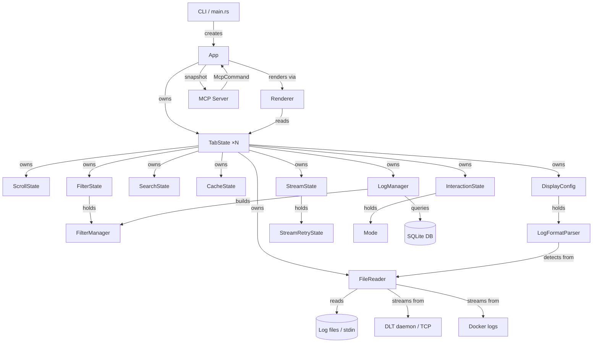
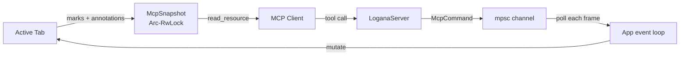
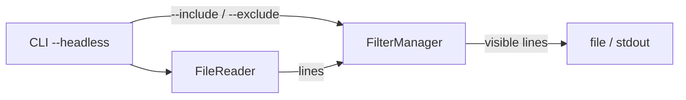
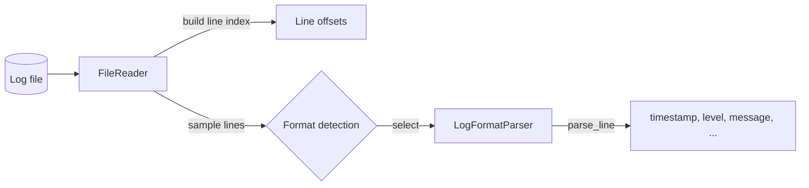
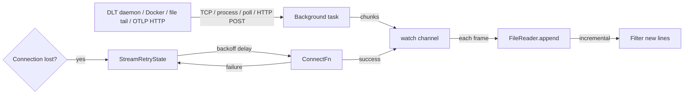
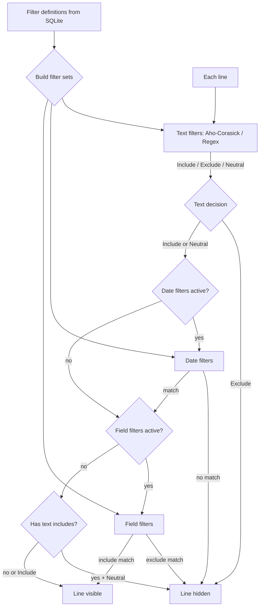

# logana Architecture

Terminal-based log analysis tool built in Rust with a Ratatui TUI. Filters and UI context are persisted in SQLite.

## High-Level Design

logana is structured around a strict separation between domain logic and the UI layer. The application is divided into five broad concerns:

**File I/O & Ingestion** — `FileReader` reads regular files and exposes O(1) random line access via a pre-built offset index.
- Stdin is handled separately by a background thread that accumulates bytes and publishes snapshots.
- Streaming sources (DLT TCP, Docker logs, file tailing, OTLP HTTP) deliver chunks through a watch channel that the event loop appends each frame.
- Binary data formats like DLT are converted to newline-delimited text before entering the line-based pipeline.
- The OTLP HTTP receiver (`FileReader::spawn_otlp_http_receiver`) listens on a local port (default 4318), accepts `POST /v1/logs` with both `application/json` and `application/x-protobuf` payloads (gzip-compressed variants supported), flattens each `LogRecord` into a newline-delimited JSON line, and feeds it through the existing `OtlpParser`.

**Log Parsing** — A format-detection registry (`parser/`) inspects incoming bytes and selects the best `LogFormatParser` implementation (JSON, syslog, journalctl, logfmt, CLF, DLT, etc.).
- Parsers extract a normalised `DisplayParts` struct (timestamp, level, target, message, extra fields) that the rest of the system consumes uniformly regardless of the original format.
- Every extra field carries a `FieldSemantic` tag (e.g. `Pid`, `Hostname`, `TraceId`, `HttpStatus`). `FieldSemantic` implements `Display` to expose a canonical name for each variant (e.g. `Pid` → `"pid"`, `TraceId` → `"traceId"`), enabling format-agnostic field filtering regardless of the raw key name (`_PID`, `procid`, or `pid` all resolve to `"pid"`).
- Log format key→slot mappings are encoded in `LogSchema` constants (`schema.rs`). The `JsonParser` and `LogfmtParser` are schema-driven: each `JsonParser` instance carries a `LogSchema` (journalctl-json, tracing-json, GELF, or generic JSON). Adding a new structured format requires only a new `LogSchema` constant — no changes to parser logic.
- `collect_field_names()` returns canonical names for all fields: primary slots (`"timestamp"`, `"level"`, `"target"`, `"message"`) and semantic extras (e.g. `"hostname"` for `_HOSTNAME`, `"traceId"` for `trace_id`). Raw key aliases are collapsed to their canonical form.
- All parsers use `push_field_as(fields, semantic, key, value)` to explicitly tag extra fields with their semantic.

**Filter Pipeline** — `FilterManager` compiles filter definitions into Aho-Corasick automata or regexes and evaluates them against every line to produce a visibility bitmap.
- The pipeline runs in a background thread so the UI stays responsive during large scans. 
- For streaming sources, new lines are filtered incrementally. 
- Filter definitions are persisted to SQLite and reloaded on startup.
- Date filters (`@date:` prefix) and field filters (`@field:` prefix) are stored as regular filter entries but applied as separate post-processing steps after text filters run.

**Mode System** — The UI is vim-inspired: a state machine (`mode/`) where each mode captures keyboard input and handles it independently. Modes return a `KeyResult` that the event loop acts on for effects beyond the mode's scope (closing tabs, clipboard, navigation).
- **Normal** — default log browsing, scrolling, marks
- **Command** — `:` command input with tab completion
- **Search** — `/` and `?` incremental search
- **Filter** — sidebar filter management (add, edit, toggle, reorder)
- **Visual / Visual Char** — line and character selection for copy/export
- **Comment** — annotate individual log lines
- **Select Fields** — choose and reorder displayed fields
- **DLT Select / Docker Select** — pick a streaming source to connect to
- **OTLP** — `:otlp [port]` command opens a receiver tab (no interactive picker needed)
- **UI / Keybindings Help** — settings and shortcut reference

**UI & Rendering** — `ui/` owns the terminal handle and drives the Ratatui render loop. 
- The renderer reads tab state and produces widgets each frame; it never mutates state. 
- The event loop dispatches key events to the active mode and acts on the returned result. 
- Session state (open tabs, filters, marks, scroll position) is persisted to SQLite and restored on reopen. 

**Headless** - A headless mode bypasses the TUI for scripted filter-and-export workflows.

**MCP Server** — An optional embedded [Model Context Protocol](https://modelcontextprotocol.io/) server (`mcp/`) that exposes marks and annotations as MCP resources and accepts tool calls that mutate TUI state.
- Implemented with the `rmcp` crate using the Streamable HTTP transport, served via `axum` at `/mcp`.
- The server holds a shared `Arc<RwLock<McpSnapshot>>` that is refreshed from the active tab each render frame.
- Tool calls (`toggle_mark`, `add_annotation`, `remove_annotation`) are sent over an `mpsc` channel and applied to the active tab by the event loop, keeping all mutable state on the TUI thread.
- Started via the `--mcp [PORT]` CLI flag (default port 9876) or the `:enable-mcp` / `:disable-mcp` commands at runtime.
- The default port can be set in the config file (`mcp_port`).

## Component Diagram

```mermaid
flowchart TD
    CLI[CLI / main.rs] -->|creates| App[App]
    App -->|owns| Tab[TabState ×N]
    App -->|renders via| Renderer[Renderer]
    Tab -->|owns| Scroll[ScrollState]
    Tab -->|owns| Filter[FilterState]
    Tab -->|owns| Search[SearchState]
    Tab -->|owns| Cache[CacheState]
    Tab -->|owns| Stream[StreamState]
    Tab -->|owns| Display[DisplayConfig]
    Tab -->|owns| Interaction[InteractionState]
    Tab -->|owns| FileReader[FileReader]
    Tab -->|owns| LogManager[LogManager]
    Filter -->|holds| FM[FilterManager]
    Display -->|holds| Parser[LogFormatParser]
    Stream -->|holds| Retry[StreamRetryState]
    Interaction -->|holds| Mode[Mode]
    LogManager -->|queries| DB[(SQLite DB)]
    LogManager -->|builds| FM
    FileReader -->|reads| Files[(Log files / stdin)]
    FileReader -->|streams from| DLT[DLT daemon / TCP]
    FileReader -->|streams from| Docker[Docker logs]
    Renderer -->|reads| Tab
    Parser -->|detects from| FileReader
    App -->|snapshot| MCP[MCP Server]
    MCP -->|McpCommand| App
```

`TabState` is decomposed into focused sub-structs in `src/ui/tab_state/`:
- `ScrollState` — scroll/viewport offsets and dimensions
- `FilterState` — filter visibility, styles, handle, and `FilterManager`
- `SearchState` — current search query and async handle
- `CacheState` — parsed-line and render-line caches keyed by generation
- `StreamState` — file-watch state, tail mode, retry state
- `DisplayConfig` — display flags, format parser, hidden fields, field layout
- `InteractionState` — active mode, keybindings, notifications, command history

All `impl TabState` methods remain on `TabState` to avoid cross-cutting borrow complexity.

### Popup Widgets

Popup rendering is implemented as ratatui `Widget` types in `src/ui/widgets/`:
- `ConfirmRestoreModal` / `ConfirmRestoreSessionModal` / `ConfirmOpenDirModal` — session/directory confirmation dialogs
- `CommentPopup` — inline log-line annotation editor (exposes `cursor_position()` for `frame.set_cursor_position`)
- `SelectFieldsPopup` — field visibility and reorder modal
- `DockerSelectPopup` / `DltSelectPopup` — streaming source selection (DLT includes an add-device form)
- `ValueColorsPopup` — value/level colour toggle list with fuzzy search
- `KeybindingsHelpPopup` — keybindings reference with search filtering
- `ModeBar` — status/keybindings bar rendered at the bottom of the screen

Each widget borrows `&Theme` and `&Keybindings` plus the mode-specific data cloned in `App::ui()`. `App::ui()` constructs the widget and calls `frame.render_widget(popup, frame.area())`.

`App::ui()` is decomposed into focused helper methods (`extract_ui_render_state`, `build_layout_constraints`, `compute_main_areas`, `render_tab_bar_widget`, `render_log_panel_and_sidebar`, `render_command_bar_widget`, `render_input_bar_widget`, `render_notification`, `render_warnings`, `render_mode_bar_widget`, `render_overlay_popups`), each kept under 50 lines. The top-level `ui()` method is a thin coordinator that calls these helpers in order.

## MCP Server

```mermaid
flowchart LR
    Tab[Active Tab] -->|marks + annotations| Snapshot[McpSnapshot\nArc-RwLock]
    Snapshot -->|read_resource| Client[MCP Client]
    Client -->|tool call| Server[LoganaServer]
    Server -->|McpCommand| Ch[mpsc channel]
    Ch -->|poll each frame| App[App event loop]
    App -->|mutate| Tab
```

## Headless Mode

```mermaid
flowchart LR
    CLI[CLI --headless] --> FR[FileReader]
    CLI -->|--include / --exclude| FM[FilterManager]
    FR -->|lines| FM
    FM -->|visible lines| Out[file / stdout]
```

## File-Based Ingestion

```mermaid
flowchart LR
    File[(Log file)] --> FR[FileReader]
    FR -->|build line index| Lines[Line offsets]
    FR -->|sample lines| Detect{Format detection}
    Detect -->|select| Parser[LogFormatParser]
    Parser -->|parse_line| Fields[timestamp, level, message, ...]
```

## Stream-Based Ingestion

```mermaid
flowchart LR
    Source[DLT daemon / Docker / file tail / OTLP HTTP] -->|TCP / process / poll / HTTP POST| BG[Background task]
    BG -->|chunks| WatchCh[watch channel]
    WatchCh -->|each frame| Append[FileReader.append]
    Append -->|incremental| Filter[Filter new lines]

    Fail{Connection lost?} -->|yes| Retry[StreamRetryState]
    Retry -->|backoff delay| Reconnect[ConnectFn]
    Reconnect -->|success| WatchCh
    Reconnect -->|failure| Retry
```

## Filter Pipeline

```mermaid
flowchart TD
    Defs[Filter definitions from SQLite] --> Build{Build filter sets}
    Build --> Text[Text filters: Aho-Corasick / Regex]
    Build --> Date[Date filters]
    Build --> Field[Field filters]

    Line[Each line] --> Text
    Text -->|Include / Exclude / Neutral| Decision{Text decision}
    Decision -->|Exclude| Hidden[Line hidden]
    Decision -->|Include or Neutral| DateCheck{Date filters active?}
    DateCheck -->|yes| Date
    Date -->|no match| Hidden
    Date -->|match| FieldCheck
    DateCheck -->|no| FieldCheck{Field filters active?}
    FieldCheck -->|yes| Field
    Field -->|exclude match| Hidden
    Field -->|include match| Visible[Line visible]
    FieldCheck -->|no| Resolve{Has text includes?}
    Resolve -->|yes + Neutral| Hidden
    Resolve -->|no or Include| Visible
```

## Dependencies

| Crate | Role | Why |
|---|---|---|
| **ratatui** | TUI rendering | Immediate-mode terminal UI; widgets are stateless values composed each frame, which eliminates a whole class of stale-state bugs |
| **crossterm** | Terminal I/O, key events | Cross-platform raw mode and keyboard input, including kitty keyboard protocol for disambiguating modifier keys |
| **tokio** | Async runtime | Drives the event loop and background tasks (file loading, filter computation, stdin streaming) without blocking the render thread |
| **memchr** | SIMD byte scanning | Accelerates the line-indexing pass; scanning for `\n`, `\r`, and ESC in a single pass is faster than calling `memchr` three times separately |
| **aho-corasick** | Literal substring matching | Optimal for the common case of plain-text filter patterns; builds a finite automaton once and matches in O(input) regardless of pattern count |
| **regex** | Regex matching | Used only when a pattern contains metacharacters; compiled once and cached |
| **rayon** | Parallel iteration | Parallelises both Phase 1 line indexing (chunk scan) and the visibility scan across file lines on machines with multiple cores; transparent fallback to sequential on single-core |
| **sqlx** | SQLite async driver | Persists filter definitions and session state (scroll position, marks, comments) between runs; async so DB writes don't stall the event loop |
| **clap** | CLI argument parsing | Declarative argument definitions with auto-generated help text |
| **serde / serde_json** | Config and theme serialisation | JSON config file, theme files, and filter import/export |
| **serde_with** | Serde helpers | Provides derive macros for custom serialisation of types that don't implement `Serialize`/`Deserialize` directly, used for persisting ratatui `Color` values in the DB |
| **time** | Date and time parsing | Parses and normalises timestamps for the date-range filter; chosen over `chrono` for its stricter API and active maintenance |
| **unicode-width** | Terminal column width | Correctly measures the display width of Unicode characters (CJK double-width, zero-width combiners) so cursor positioning and text truncation stay accurate |
| **arboard** | Clipboard | Cross-platform clipboard access for yank/copy operations |
| **dirs** | XDG data directory | Locates the platform-appropriate directory for the SQLite database without hardcoding paths |
| **anyhow** | Error handling | Ergonomic error propagation with context in the top-level `main` |
| **async-trait** | Async trait methods | Native `async fn` in traits (stable since 1.75) is not object-safe: each impl returns a differently-sized future, which a vtable cannot handle. The crate rewrites async methods to return `Pin<Box<dyn Future>>` — a fixed-size pointer — making the trait usable as `Box<dyn Mode>`. The same can be written by hand; the crate is purely a syntactic convenience |
| **tokio-util** | Async utilities | Provides `CancellationToken` for cooperative shutdown of the MCP HTTP server |
| **tempfile** | Temporary files | Creates named temporary files in tests for headless-mode and filter integration tests |
| **rmcp** | MCP server | Implements the Model Context Protocol server side; provides the `tool` / `tool_router` macros, resource/tool dispatch, and the Streamable HTTP transport |
| **axum** | HTTP server | Hosts the MCP Streamable HTTP service; used only as the transport layer for the MCP server |
| **opentelemetry-proto** | OTLP protobuf types | Pre-generated prost bindings for `ExportLogsServiceRequest` and related types; enables decoding binary protobuf OTLP payloads |
| **prost** | Protobuf decoding | Runtime support for `Message::decode`; used to deserialise OTLP protobuf payloads in the HTTP receiver |
