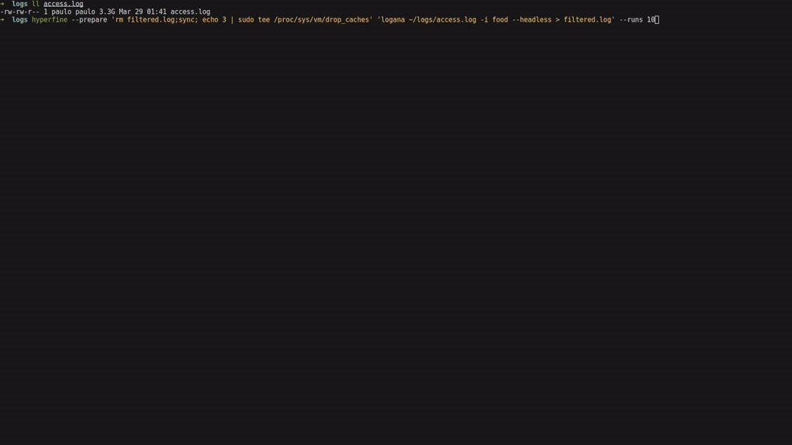

# logana

<p align="center">
  <a href="https://github.com/pauloremoli/logana/actions?query=workflow%3ARust"></a>
  <a href="https://codecov.io/gh/pauloremoli/logana"></a>
  <a href="https://crates.io/crates/logana"></a>
  <a href="https://crates.io/crates/logana"></a>
  <a href="https://github.com/pauloremoli/logana/blob/main/LICENSE"></a>
</p>

<p align="center">
  logana turns any log source — files, compressed archives, Docker containers, or OTel streams — into structured, filterable, annotatable data. Filter by pattern, field, or date range; jump between errors and warnings; annotate key lines; bookmark findings; and export to Markdown, Jira, or AI assistants via the built-in MCP server — all persistent across sessions.
</p>

<p align="center">
  
</p>

---

## Features

**Formats & input**
- **Auto-detected log formats** — JSON, syslog, journalctl, logfmt, OpenTelemetry, DLT (AUTOSAR), and more
- **Compressed & archive files** — open `.gz`, `.bz2`, `.xz`, `.zip`, `.tar`, `.tar.gz`/`.tgz`, `.tar.bz2`/`.tbz2`, and `.tar.xz`/`.txz` directly; no manual extraction needed
- **OTel collector** — receive OpenTelemetry logs in real time over gRPC or HTTP/JSON; compatible with any OTel SDK
- **Multi-tab** — open multiple files, Docker streams, DLT daemon connections, or OTel collector tabs; use `:merge` to interleave selected tabs into a single chronological view

**Filtering & search**
- **Filtering** — include/exclude patterns (literal or regex), date-range filters, field-scoped filters; add filters from the command line with `-i`/`-o`/`-t`
- **Headless mode** — run the full filter pipeline without a TUI to preprocess huge logs
- **Structured field view** — parsed timestamps, levels, targets, and extra fields displayed in columns

**Navigation**
- **Vim-style navigation** — `j`/`k`, `gg`/`G`, `Ctrl+d`/`u`, count prefixes (`5j`, `10G`), `/` search
- **Error/warning navigation** — jump directly to the next/previous error or warning with `e`/`w`
- **Mouse support** — click to select, scroll to navigate
- **Value coloring** — HTTP methods, status codes, IP addresses, and UUIDs colored automatically

**Analysis & integrations**
- **Persistent sessions** — filters, scroll position, marks, and annotations survive across runs; configurable restore policy (ask / always / never)
- **Annotations** — attach comments to log lines; export analysis to Markdown or Jira
- **MCP server** — embedded Model Context Protocol server; expose marks and annotations to AI assistants
- **Fully configurable** — all keybindings remappable via a config file

---

## Installation

### Pre-built binaries (recommended)

Download from the [Releases page](https://github.com/pauloremoli/logana/releases), or use the install script:

**Linux / macOS**
```sh
curl -fsSL https://github.com/pauloremoli/logana/releases/latest/download/logana-installer.sh | sh
```

**Windows (PowerShell)**
```powershell
irm https://github.com/pauloremoli/logana/releases/latest/download/logana-installer.ps1 | iex
```

### Homebrew (macOS / Linux)

```sh
brew tap pauloremoli/logana && brew install logana
```

### Cargo

```sh
cargo install logana
# or install the latest binary directly
cargo binstall logana
```

---

## Performance

Benchmarked against [lnav](https://lnav.org/) filtering a [**3.3 GB web server access log with 10 million+ lines**](https://www.kaggle.com/datasets/eliasdabbas/web-server-access-logs), cold disk cache.

### Headless mode — 10 runs

<p align="center">
  
</p>

**logana**
```

hyperfine --prepare 'rm filtered.log;sync; echo 3 | sudo tee /proc/sys/vm/drop_caches' 'logana ~/logs/access.log -i food --headless > filtered.log' --runs 10
Benchmark 1: logana ~/logs/access.log -i food --headless > filtered.log
  Time (mean ± σ):     994.1 ms ±   6.2 ms    [User: 2629.3 ms, System: 3059.8 ms]
  Range (min … max):   982.6 ms … 1003.6 ms    10 runs
```

**lnav**
```
$ hyperfine --prepare 'rm filtered.log;sync; echo 3 | sudo tee /proc/sys/vm/drop_caches' \
  'lnav ~/logs/access.log -c ":filter-in food" -n > filtered.log' --runs 10

Benchmark 1: lnav ~/logs/access.log -c ":filter-in food" -n > filtered.log
  Time (mean ± σ):     11.197 s ±  0.140 s    [User: 14.177 s, System: 1.580 s]
  Range (min … max):   10.980 s … 11.483 s    10 runs
```

**logana filters 3.3 GB / 10M+ lines in under 1 second — 11× faster than lnav.**

### TUI — filter on launch, quit when ready

```
$ time logana ~/logs/access.log -i food
logana ~/logs/access.log -i food  4.70s user 3.01s system 421% cpu 1.827 total

$ time lnav ~/logs/access.log -c ":filter-in food"
lnav ~/logs/access.log -c ":filter-in food"  12.14s user 1.37s system 114% cpu 11.819 total
```

**logana opens, filters, and renders the full TUI in 1.8 s — 6.5× faster than lnav end-to-end.**

> **Note:** lnav provides additional features beyond filtering that may account for part of the difference. This comparison covers filtering performance only.

Hardware: AMD Ryzen 9 8945HS · 32 GB DDR5 5600 MHz · PCIe NVMe 4.0 x4

---

## Quick Start

```sh
# Open a file
logana app.log

# Open a directory (each file opens in its own tab)
logana /var/log/

# Open a compressed or archive file directly
logana app.log.gz
logana logs.tar.gz

# Pipe from stdin
journalctl -f | logana

# Start at the end and follow new lines
logana app.log --tail

# Stream a Docker container
logana            # then type :docker

# Receive OpenTelemetry logs over gRPC (port 4317)
logana            # then type :otel

# Add inline filters on the command line
logana app.log -i error -o debug
logana app.log -i "--field level=ERROR" -t "> 2024-02-21"

# Headless — filter without the TUI, output to stdout or a file
logana app.log --headless -i error -o debug
logana app.log --headless -i error --output filtered.log
```

---

## Documentation

Full documentation is at **[pauloremoli.github.io/logana](https://pauloremoli.github.io/logana/)**.

- [Quick Start](https://pauloremoli.github.io/logana/quick-start.html)
- [Commands](https://pauloremoli.github.io/logana/commands.html)
- [Filtering](https://pauloremoli.github.io/logana/filtering/)
- [Configuration](https://pauloremoli.github.io/logana/configuration/)
- [Keybindings](https://pauloremoli.github.io/logana/configuration/keybindings.html)
- [Annotations](https://pauloremoli.github.io/logana/annotations.html)
- [OTel Collector](https://pauloremoli.github.io/logana/otel.html)
- [MCP Server](https://pauloremoli.github.io/logana/mcp.html)
- [Log Formats](https://pauloremoli.github.io/logana/log-formats.html)
