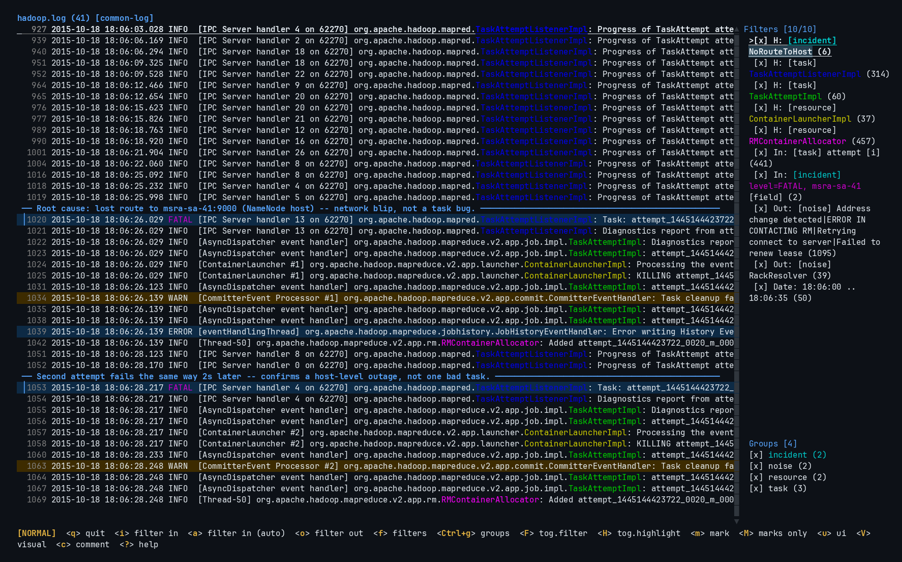

# logana

<p align="center">
  <a href="https://github.com/pauloremoli/logana/actions?query=workflow%3ARust"></a>
  <a href="https://codecov.io/gh/pauloremoli/logana"></a>
  <a href="https://crates.io/crates/logana"></a>
  <a href="https://crates.io/crates/logana"></a>
  <a href="https://github.com/pauloremoli/logana/blob/main/LICENSE"></a>
</p>

<p align="center">
  A fast terminal log viewer. Filter logs of any size and format, mark and annotate what matters, then export your findings.
</p>

<p align="center">
  
</p>

- Any log format — JSON, syslog, logfmt, OpenTelemetry, DLT, or a custom schema
- Include/exclude/highlight filters — by text, regex, field, or date range
- Bookmark and annotate lines, then export to Markdown or Jira
- Vim-style navigation, fully remappable keybindings
- MCP server to expose your findings to AI assistants

---

## Installation

### Pre-built binaries (recommended)

Download from the [Releases page](https://github.com/pauloremoli/logana/releases), or use the install script:

**Linux / macOS**
```sh
curl -fsSL https://github.com/pauloremoli/logana/releases/latest/download/logana-installer.sh | sh
```

**Windows (PowerShell)**
```powershell
irm https://github.com/pauloremoli/logana/releases/latest/download/logana-installer.ps1 | iex
```

### Homebrew (macOS / Linux)

```sh
brew tap pauloremoli/logana && brew install logana
```

### Cargo

```sh
cargo install logana
# or install the latest binary directly
cargo binstall logana
```

---

## Documentation

Full documentation is at **[pauloremoli.github.io/logana](https://pauloremoli.github.io/logana/)**.

- [Quick Start](https://pauloremoli.github.io/logana/quick-start.html)
- [Commands](https://pauloremoli.github.io/logana/commands.html)
- [Filtering](https://pauloremoli.github.io/logana/filtering/)
- [Configuration](https://pauloremoli.github.io/logana/configuration/)
- [Keybindings](https://pauloremoli.github.io/logana/configuration/keybindings.html)
- [Annotations](https://pauloremoli.github.io/logana/annotations.html)
- [OTel Collector](https://pauloremoli.github.io/logana/otel.html)
- [MCP Server](https://pauloremoli.github.io/logana/mcp.html)
- [Log Formats](https://pauloremoli.github.io/logana/log-formats.html)
- [Custom Schemas](https://pauloremoli.github.io/logana/custom-schemas.html)
